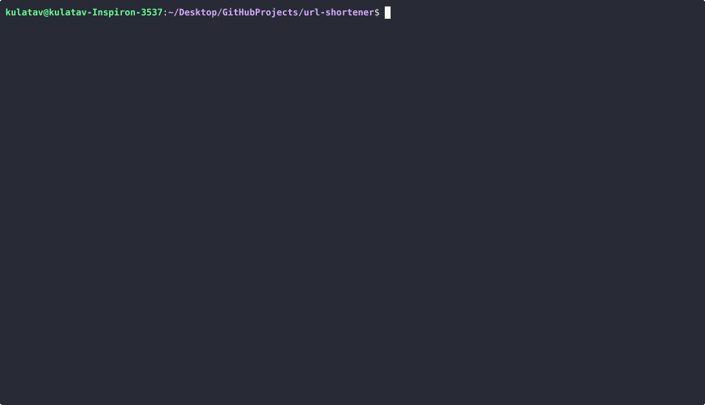

# URL Shortener Web App

A simple Python web application built with Flask to shorten URLs and redirect to original links, with SQLite storage.

## Features
- Shorten long URLs via a web form.
- Redirect from short URLs to original URLs.
- View all shortened URLs with click counts, creation timestamps, and expiration status in an admin page.
- Input validation for URLs.
- Persistent storage using SQLite.

## Installation
1. Clone the repository:
   ```bash
   git clone https://github.com/kulatav/url-shortener.git
   cd url-shortener

2. Create and activate a virtual environment:
    python -m venv venv
    source venv/bin/activate  # On Windows: venv\Scripts\activate

3. Install dependencies:
    pip install -r requirements.txt
    
4. Run the application:
    python app.py
    Open http://localhost:5000 in your browser.

    Usage
        Enter a URL in the form to get a shortened link.
        Visit the shortened link (e.g., http://localhost:5000/abc123) to redirect to the original URL.
        Access /admin to view all shortened URLs.

5. Exit the virtual environment (if needed):
    deactivate

## Demo


## License  
MIT License